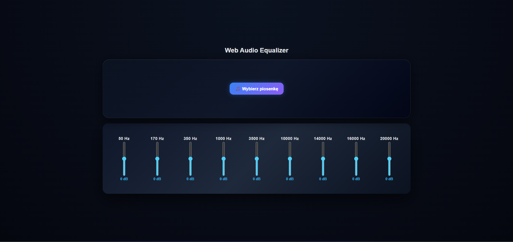

Web Audio Equalizer + Visualizer

A simple web-based audio player built with React and Web Audio API, featuring a real-time 10-band equalizer and live frequency visualizer (bass / mids / highs).

------------------------------------------------------------

FEATURES

- Upload and play audio files locally
- 10-band equalizer (50Hz – 20kHz)
- Real-time audio processing using Web Audio API
- Live visualizer (bass / mids / highs)
- Volume control
- Progress bar with seeking
- Smooth animations and UI

------------------------------------------------------------

HOW IT WORKS

Uses Web Audio API:

AudioContext → main audio engine
BiquadFilterNode → equalizer bands
AnalyserNode → frequency visualization

Audio flow:

Audio Source → EQ Filters → Analyser → Speakers

------------------------------------------------------------

TECH STACK

- React
- JavaScript (ES6+)
- Web Audio API
- CSS

------------------------------------------------------------

INSTALLATION

git clone https://github.com/matixxx360xx/equalizer-app.git
cd equalizer-app
npm install
npm run dev

------------------------------------------------------------

EQUALIZER BANDS

50 Hz     - Bass
170 Hz    - Low
350 Hz    - Low-Mid
1000 Hz   - Mid
3500 Hz   - Upper Mid
10000 Hz  - High
14000 Hz  - High
16000 Hz  - High
20000 Hz  - Air

------------------------------------------------------------

VISUALIZER

Bass  = low frequencies (0–10)
Mids  = middle frequencies (10–40)
Highs = high frequencies (40–80)

Bars react in real time to audio intensity.

------------------------------------------------------------

FUTURE IDEAS

- Canvas spectrum analyzer
- Playlist system
- Save EQ presets
- Dark/light theme
- Mobile optimization

------------------------------------------------------------

AUTHOR

Made by: matixxx360xx

------------------------------------------------------------
